# Settings

In most cases the settings page will be configured by the person or organisation that installed the cms. Some parts of the settings are only for technical modifications.

## General

At the top of the general settings you get warnings about important parts that aren't configured yet.

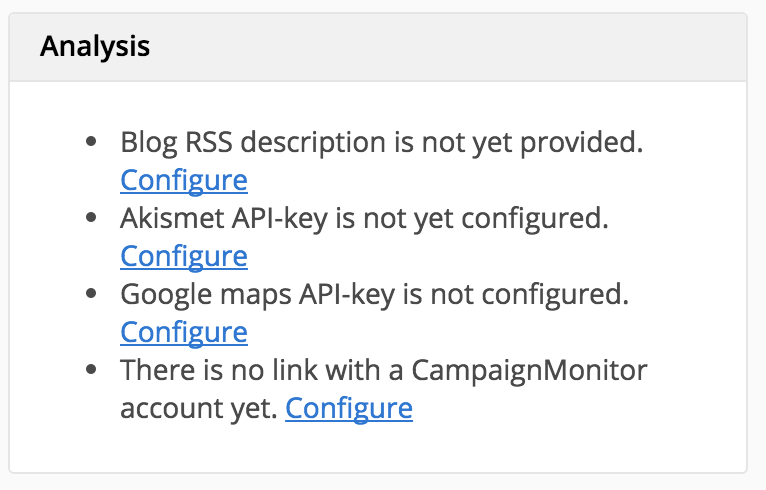

The general settings let you change some parameters that affect the whole website, independently of page, module or theme. The first parameter is a good example of such a setting, the website title will be used on different places on the website including the header and footer.

Pro tip: It’s not possible to change the default language in the cms (backend) but that can easily be done in the configuration. See the SITE_DEFAULT_LANGUAGE global in /library/globals_frontend.php.

### Scripts

The scripts textareas are made to add javascript files over the whole website. Watch the amount of javascript files you include on your website, requesting to many files can have a negative impact on the speed. Past the whole html tag to include the file, e.g.: .

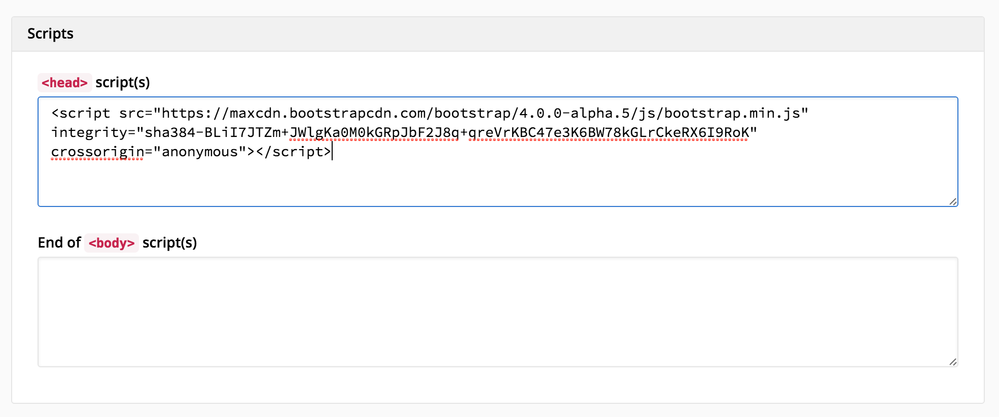

### Languages

The languages allow you to prepare extra languages before publishing it for your customers.

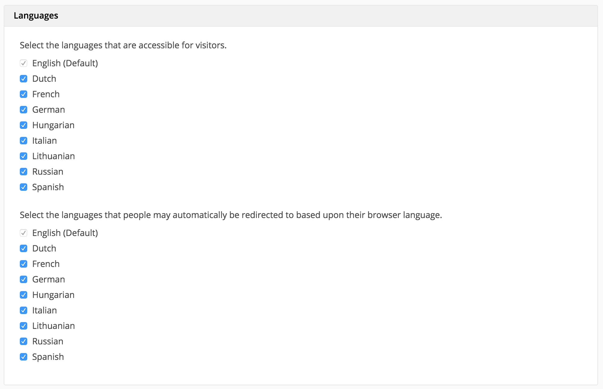

### API keys

* The fork API keys are automatically generated for other applications to connect with your website.
* The Akismet is a spam filter service, it is free for non-business personal websites or blogs. You can request a key at https://akismet.com/signup/. After inserting the key the spam will automatically be filtered.

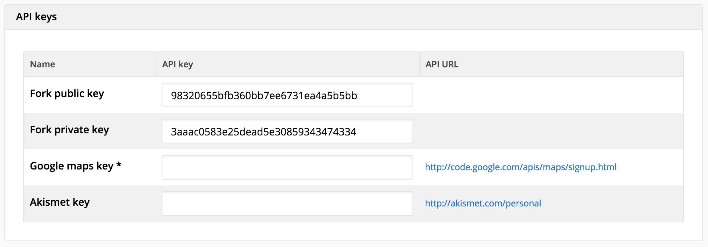

### CKFinder

The CKFinder-plugin for CKEditor to allow people to upload and manage files through the editor. CKFinder isn't a open-source so [Wijs](http://www.wijs.be), [figure8](http://www.figure8.be) and [SumoCoders](http://www.sumocoders.be) sponsort an OEM-license.

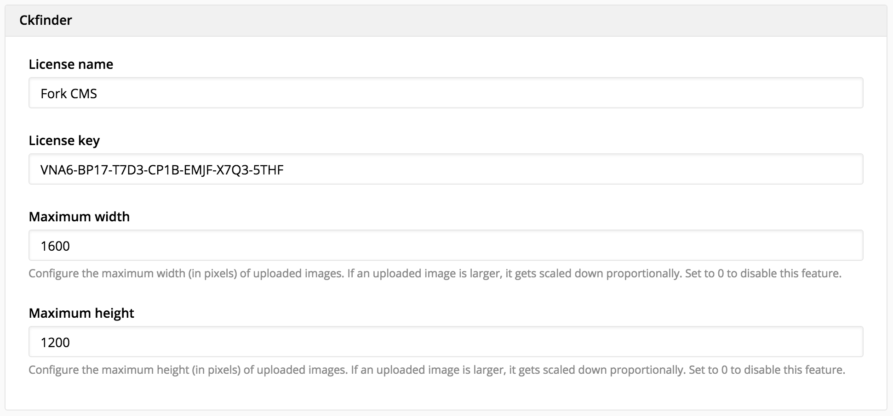

### Facebook

Adding a Facebook admin id allows the administrator to view the website in [Facebook Insights](https://www.facebook.com/insights/). If you optionally provide an application id and an app secret, it will allow you to see extra app related interactions in the Insights.

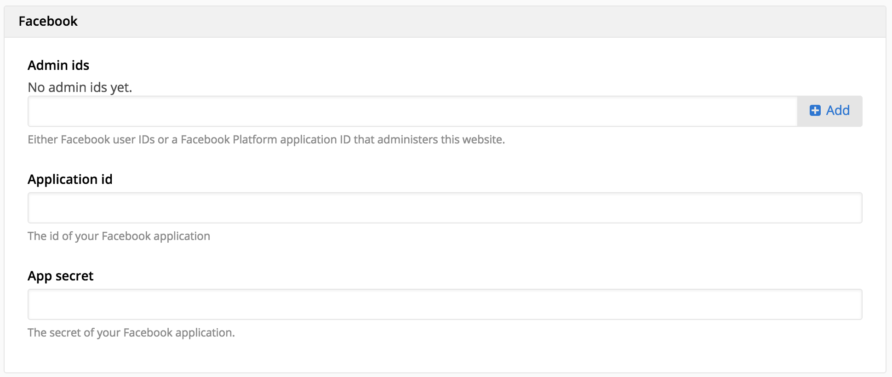

## Advanced

The more advanced settings are specially for the dedicated technical people. Although every administrator should change the names and email address where the cms will send from.

## Translations

Every word of the website can be edited in the cms. Use the filter panel at the top to find the text you want to change. More about how the translation works is explained in the theme guide.

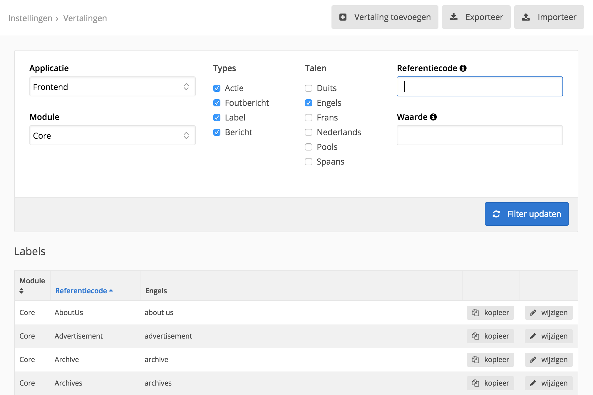

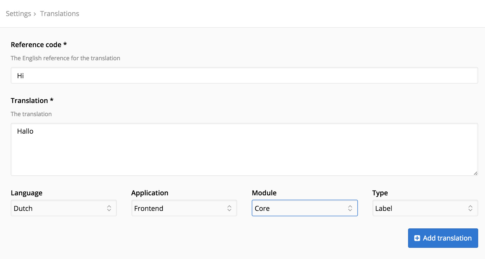

## Users & Groups

The users are logins that can be used to access the cms (backend) or the API. The best case is that every person or application has his own login. The permissions of these users are set by groups.

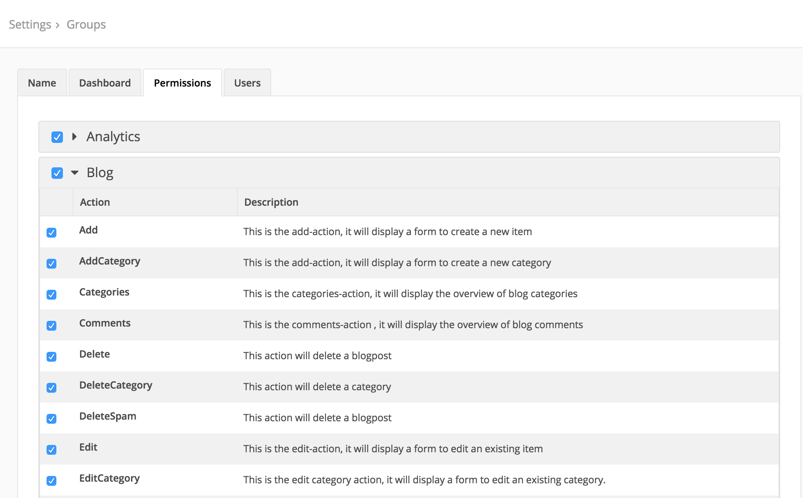

## Modules

The overview shows the installed and uploaded modules, furthermore it allows you to upload another module. The other pages are module specific settings.

### Pages

The metanavigation functionality is dependent on the theme, make sure your theme is compatible before enabling.

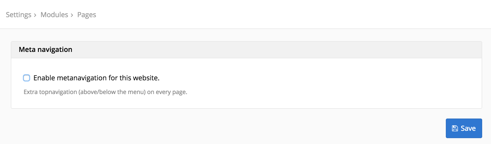

### Search

The most interesting settings for the search modules are the weights. The higher the weight is the more important the module is. The most important modules will appear first in the search results.

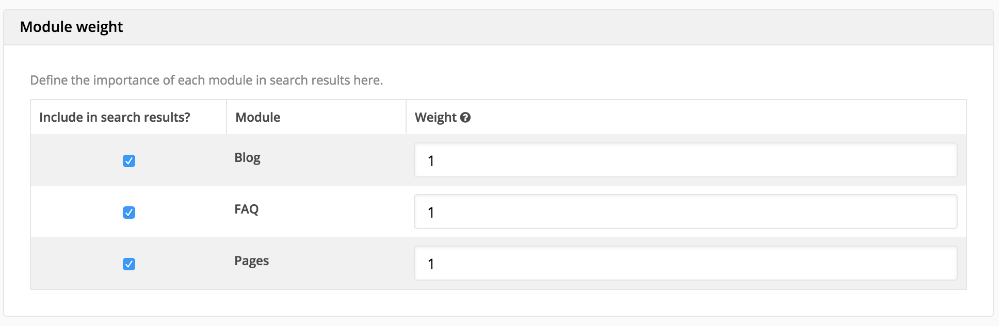

### Analytics

See the in depth article about linking a Google Analytics account.

### Mailmotor

The custom price functionality in the Mailmotor settings is made for companies that deploy websites without settings permissions. This enables them to charge an extra percentage on the Mailmotor prices.

## Themes

Just as the module overview, the first page in the themes settings shows the installed and uploaded themes, furthermore it allows you to upload another theme. Click on the desired theme to change your layout, but don’t forget to press the save button.

The templates section let you create, update and delete templates. See the theme guide for further information.

## Privacy

The privacy section lets you control how the site handles visitor consent under GDPR. When the consent dialog is enabled, visitors are asked for their preferences before any optional cookies are set.

### Show the privacy preferences dialog

Tick this checkbox to activate the consent banner. When disabled, no banner is shown and no consent logic runs.

### Consent levels

Once the dialog is enabled you can choose which consent levels to offer visitors. These map directly to Google’s Consent Mode v2 signal names so any tags in Google Tag Manager that are configured to respect consent will work automatically.

**Functional cookies** and **Security cookies** are always ticked and greyed out — they cover what is strictly necessary for the site to function and do not require consent under GDPR.

The five optional levels you can enable are:

| Level | What it covers |
|---|---|
| Advertising cookies | Storing and reading ad-related cookies |
| Ad user data | Sending user data to Google for advertising |
| Ad personalization | Personalising ads based on browsing behaviour |
| Analytics cookies | Measuring and analysing visitor behaviour |
| Personalization cookies | Storing personal preferences |

Only enable the levels that match what your site actually does. For most sites **Analytics cookies** plus one or more of the advertising levels is sufficient.

> After adding or removing a level, every visitor will see the consent dialog again on their next visit. Their previous consent no longer covers the updated set of levels, so they must re-confirm.

For more detail on how the consent dialog works technically — including Google Tag Manager setup, theming, and reading consent in your own modules — see the [Consent Dialog module guide](../05.%20module%20guide/29.%20consent_dialog.md).
